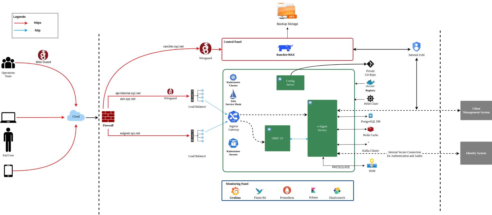

# On-Prem Installation Guidelines

### Overview <a href="#overview" id="overview"></a>

This guide provides comprehensive instructions for deploying eSignet. eSignet operates as a collection of microservices hosted within Kubernetes clusters to ensure scalability, modularity, and high availability.


This guide is applicable only for eSignet version 1.5.0 and above.


* The deployment process includes the following key components and configurations:
  * **Wireguard**: [Wireguard](https://www.wireguard.com/) is used as a trust network extension to access the admin, control, and observation pane along with on-field registration client connectivity to the backend server.
  * **Nginx Server**: eSignet uses the Nginx server for:
    * SSL termination
    * Reverse Proxy
    * CDN/Cache management
    * Load balancing
  * **Kubernetes (K8s) Cluster**: Kubernetes (K8s) cluster creation, configuration and administration of same.
    * K8 cluster is created using the [Rancher](https://rancher.com/docs/rancher/v1.3/en/kubernetes/#rancher-ui) and [rke](https://www.rancher.com/products/rke) tools.
    * K8 cluster essentially used in ref-impl architecture:
      * Observation K8 cluster
      * eSignet application K8 cluster
  * **Cluster Configurations:**
    * **Ingress Setup**: For exposing application services outside the K8s cluster.
    * **Storage Class Setup**: This is used to set up the storage class for persistence in the K8 cluster.
    * **Logging System**: Continuously scrapes logs from all pods as needed.
    * **Monitoring System**: Continuously monitors logs and generates graphs to better manage the application and cluster.
    * **Alerting**: Users are identified about crucial events as and when needed.
  * **Observation K8** cluster contains:
    * **Rancher Ui**: application used to create and manage the k8 cluster. This is needed once for an organization as it can manage multiple dev, qa, and prod k8 clusters easily.
    * **Kecloak**: IAM tool used for defining RBAC policies for allowing access to Rancher.
  * **eSignet cluster**: This cluster hosts all eSignet components, along with certain third-party components, to ensure the cluster's security, APIs, and data.
*   **eSignet Pre-requisites:**

    These are the services required to deploy multiple eSignet modules:

    * **eSignet-prerequisites**: Servicess required for `esignet-service` and `oidc-ui` deployment.
    * **eSignet-mock-prerequisites**: Servicess required for `mock-relying-party` and `mock-relying-party-ui` deployment.
    * **eSignet-signup**: Services required for `esignet-signup-service` and `esignet-signup-ui` deployment.
* **eSignet Services deployment:**
  * `esignet-service` and `oidc-ui` deployment.
  * Onboarding MISP partner for eSignet service.
  * `mock-relying-party-service` and `mock-relying-party-ui` deployment.
  * Onboarding `mock-relying-party`.
  * `esignet-signup-service` and `esignet-signup-ui` deployment.
  * Onboarding MISP partner for `esignet-signup-partner`.

### Architecture  <a href="#architecture-todo" id="architecture-todo"></a>

The diagram below illustrates the **deployment architecture** of the eSignet, highlighting secure user access via VPN, traffic routing through firewalls and load balancers, and service orchestration within a Kubernetes cluster.&#x20;

* **Key Components**: eSignet Service, OIDC UI, databases, and secure cryptographic operations via HSM.
* **Deployment**: Managed with Rancher, Helm charts, and a private Git repository.
* **Monitoring**: Ensured using Grafana and Prometheus for observability.

<figure><figcaption><p>eSignet Architecture diagram</p></figcaption></figure>

### Deployment Repositories <a href="#deployment-repos" id="deployment-repos"></a>

* [k8s-infra](https://github.com/mosip/k8s-infra/tree/v1.2.0.1) : contains the scripts to install and configure Kubernetes cluster with required monitoring, logging, and alerting tools.
* [eSignet](https://github.com/mosip/esignet/blob/release-1.5.x/) : Contains deployment scripts and source code for :
  * eSignet Pre-requisites services.
  * eSignet services.
  * eSignet Onboarding.
  * eSignet Api-testrig.
* [esignet-mock-services](https://github.com/mosip/esignet-mock-services/blob/release-0.10.x/) : Contains deployment script and source code for :
  * eSignet mock pre-requisites services.
  * eSignet mock services.
  * eSignet mock services onboarding.
* [esignet-signup](https://github.com/mosip/esignet-signup/tree/release-1.1.x) : Contains deployment script and source code for:
  * eSignet signup pre-requisites.
  * eSignet signup services.
  * eSignet signup onboarding pre-requisites.
  * eSignet signup onboarding.

### Pre-requisites <a href="#pre-requisites" id="pre-requisites"></a>

Ensure all required hardware and software dependencies are prepared before proceeding with the installation.

#### Hardware requirements <a href="#hardware-requirements" id="hardware-requirements"></a>

* Virtual Machines (VMs) can use any operating system as per convenience.
* For this installation guide, Ubuntu OS is referenced throughout.

<table data-full-width="true"><thead><tr><th width="91">Sl no.</th><th width="137">Purpose</th><th width="86">vCPU's</th><th width="79">RAM</th><th width="152">Storage (HDD)</th><th width="108">No. of VM's</th><th>HA</th></tr></thead><tbody><tr><td>1.</td><td>Wireguard Bastion Host</td><td>2</td><td>4 GB</td><td>8 GB</td><td>1</td><td>(ensure to setup active-passive)</td></tr><tr><td>2.</td><td>Observation Cluster nodes</td><td>2</td><td>8 GB</td><td>32 GB</td><td>2</td><td>2</td></tr><tr><td>3.</td><td>Observation Nginx server (use Loadbalancer if required)</td><td>2</td><td>4 GB</td><td>16 GB</td><td>1</td><td>Nginx+</td></tr><tr><td>4.</td><td>eSignet Cluster nodes</td><td>8</td><td>32 GB</td><td>128 GB</td><td>3</td><td>Allocate etcd, control plane and worker accordingly</td></tr><tr><td>5.</td><td>eSignet Nginx server ( use Loadbalancer if required)</td><td>2</td><td>4 GB</td><td>16 GB</td><td>1</td><td>Nginx+</td></tr></tbody></table>

#### Network Requirements <a href="#network-requirements" id="network-requirements"></a>

* All the VMs should be able to communicate with each other.
* Need stable intra-network connectivity between these VMs.
* All the VMs should have stable internet connectivity for docker image download (in case of local setup ensure to have a locally accessible docker registry).
* Server Interface requirements as mentioned in below table:

<table data-full-width="false"><thead><tr><th width="89">Sl no.</th><th width="172">Purpose</th><th>Network Interfaces</th></tr></thead><tbody><tr><td>1.</td><td>Wireguard Bastion Host</td><td><em>One Private interface</em>: that is on the same network as all the rest of nodes (e.g.: inside local NAT Network).<br><br><em>One public interface</em>: Either has a direct public IP, or a firewall NAT (global address) rule that forwards traffic on 51820/udp port to this interface IP.</td></tr><tr><td>2.</td><td>K8 Cluster nodes</td><td>One internal interface: with internet access and that is on the same network as all the rest of nodes (e.g.: inside local NAT Network).</td></tr><tr><td>3.</td><td>Observation Nginx server</td><td>One internal interface: with internet access and that is on the same network as all the rest of nodes (e.g.: inside local NAT Network).</td></tr><tr><td>4.</td><td>eSignet Nginx server</td><td><em>One internal interface</em>: that is on the same network as all the rest of nodes (e.g.: inside local NAT Network).<br><br><em>One public interface</em>: Either has a direct public IP, or a firewall NAT (global address) rule that forwards traffic on 443/tcp port to this interface IP.</td></tr></tbody></table>

#### DNS requirements <a href="#dns-requirements-todo" id="dns-requirements-todo"></a>

<table><thead><tr><th width="126">Sl no.</th><th width="177">Domain Name</th><th>Mapping details</th><th>Purpose</th></tr></thead><tbody><tr><td>1.</td><td>rancher.xyz.net</td><td>Private IP of Nginx server or load balancer for Observation cluster</td><td>Rancher dashboard to monitor and manage the kubernetes cluster.</td></tr><tr><td>2.</td><td>keycloak.xyz.net</td><td>Private IP of Nginx server for Observation cluster</td><td>Administrative IAM tool (keycloak). This is for the kubernetes administration.</td></tr><tr><td>3.</td><td>sandbox.xyx.net</td><td>Private IP of Nginx server for MOSIP cluster</td><td>Index page for links to different dashboards of MOSIP env. (This is just for reference, please do not expose this page in a real production or UAT environment)</td></tr><tr><td>4.</td><td>api-internal.sandbox.xyz.net</td><td>Private IP of Nginx server for MOSIP cluster</td><td>Internal API’s are exposed through this domain. They are accessible privately over wireguard channel</td></tr><tr><td>5.</td><td>api.sandbox.xyx.net</td><td>Public IP of Nginx server for MOSIP cluster</td><td>All the API’s that are publically usable are exposed using this domain.</td></tr><tr><td>6.</td><td>kibana.sandbox.xyx.net</td><td>Private IP of Nginx server for MOSIP cluster</td><td>Optional installation. Used to access kibana dashboard over wireguard.</td></tr><tr><td>7.</td><td>kafka.sandbox.xyz.net</td><td>Private IP of Nginx server for MOSIP cluster</td><td>Kafka UI is installed as part of the MOSIP’s default installation. We can access kafka UI over wireguard. Mostly used for administrative needs.</td></tr><tr><td>8.</td><td>iam.sandbox.xyz.net</td><td>Private IP of Nginx server for MOSIP cluster</td><td>MOSIP uses an OpenID Connect server to limit and manage access across all the services. The default installation comes with Keycloak. This domain is used to access the keycloak server over wireguard</td></tr><tr><td>9.</td><td>postgres.sandbox.xyz.net</td><td>Private IP of Nginx server for MOSIP cluster</td><td>This domain points to the postgres server. You can connect to postgres via port forwarding over wireguard</td></tr><tr><td>10.</td><td>onboarder.sandbox.xyz.net</td><td>Private IP of Nginx server for MOSIP cluster</td><td>Accessing reports of MOSIP partner onboarding over wireguard</td></tr><tr><td>11.</td><td>eSignet.sandbox.xyz.net</td><td>Public IP of Nginx server for MOSIP cluster</td><td>Accessing eSignet portal publically</td></tr><tr><td>12.</td><td>healthservices.sandbox.xyz.net</td><td>Public IP of Nginx server for MOSIP cluster</td><td>Accessing Health portal publically</td></tr><tr><td>13.</td><td>smtp.sandbox.xyz.net</td><td>Private IP of Nginx server for MOSIP cluster</td><td>Accessing mock-smtp UI over wireguard</td></tr></tbody></table>

#### Certificate requirements <a href="#certificate-requirements" id="certificate-requirements"></a>

As only secured https connections are allowed via nginx server will need below mentioned valid ssl certificates:

1. Wildcard SSL Certificate for the Observation Cluster:
   * A valid wildcard SSL certificate for the domain used to access the Observation cluster.
   * This certificate must be stored inside the Nginx server VM for the Observation cluster.
   * For example, a domain like \*.org.net could serve as the corresponding example.
2. Wildcard SSL Certificate for the eSignet K8s Cluster:
   * A valid wildcard SSL certificate for the domain used to access the eSignet Kubernetes cluster.
   * This certificate must be stored inside the Nginx server VM for the eSignet cluster.
   * For example, a domain like \*.sandbox.xyz.net could serve as the corresponding example.

#### Tools to be installed on Personal Computers: <a href="#tools-to-be-installed-on-personal-computers" id="tools-to-be-installed-on-personal-computers"></a>

Follow the steps mentioned [here](https://github.com/mosip/k8s-infra/tree/v1.2.0.2/mosip/on-prem#prerequisites) to install the required tools on your personal computer to create and manage the k8 cluster using RKE1.

### Installation <a href="#installation" id="installation"></a>

Below is a step-by-step guide to set up and configure the required components for secure and efficient operations.

#### Wireguard <a href="#wireguard" id="wireguard"></a>

Secure access solution that establishes private channels to Observation and eSignet clusters.


**Note:** If you already have a Wireguard bastion host then you may skip this step.


* A Wireguard bastion host (Wireguard server) provides a secure private channel to access the Observation and eSignet cluster.
* The host restricts public access and enables access to only those clients who have their public key listed in the Wireguard server.
* Wireguard listens on UDP port51820.

#### Setup Wireguard Bastion server <a href="#setup-wireguard-bastion-server" id="setup-wireguard-bastion-server"></a>

1. Create a Wireguard server VM with above mentioned Hardware and Network requirements.
2. Open ports and Install docker on Wireguard VM.

* create a copy of `hosts.ini.sample` as `hosts.ini` and update the required details for wireguard VM `cp hosts.ini.sample hosts.ini`
* execute ports.yml to enable ports on the VM level using ufw: `ansible-playbook -i hosts.ini ports.yaml`


**Note:**

* Permission of the pem files to access nodes should have 400 permissions. `sudo chmod 400 ~/.ssh/privkey.pem`
* These ports are only needed to be opened for sharing packets over UDP.
* Take necessary measures on the firewall level so that the Wireguard server can be reachable on 51820/udp publically.
* Make sure to clone the [k8s-infra](https://github.com/mosip/k8s-infra/tree/v1.2.0.2/mosip/on-prem#prerequisites) github repo for the required scripts in the above steps and perform the steps from the linked directory.
* If you already have a Wireguard server for the VPC used you can skip the setup Wireguard Bastion server section.


3. execute docker.yml command to install docker and add the user to the docker group:

```yaml
ansible-playbook -i hosts.ini docker.yaml
```

4.  Setup Wireguard server

    * SSH to wireguard VM
    * Create a directory for storing wireguard config files.

    ```sh
    mkdir -p wireguard/config
    ```

    * Install and start the wireguard server using docker as given below:

    ```sh
    sudo docker run -d \
    --name=wireguard \
    --cap-add=NET_ADMIN \
    --cap-add=SYS_MODULE \
    -e PUID=1000 \
    -e PGID=1000 \
    -e TZ=Asia/Calcutta \
    -e PEERS=30 \
    -p 51820:51820/udp \
    -v /home/ubuntu/wireguard/config:/config \
    -v /lib/modules:/lib/modules \
    --sysctl="net.ipv4.conf.all.src_valid_mark=1" \
    --restart unless-stopped \
    ghcr.io/linuxserver/wireguard
    ```


**Note:**

* Increase the no. of peers above in case more than 30 wireguard client confs (-e PEERS=30) are needed.
* Change the directory to be mounted to wireguard docker as needed. All your wireguard confs will be generated in the mounted directory (`-v /home/ubuntu/wireguard/config:/config`).


#### Setup Wireguard Client on your PC and follow the below steps: <a href="#setup-wireguard-client-in-your-pc-and-follow-the-below-steps" id="setup-wireguard-client-in-your-pc-and-follow-the-below-steps"></a>

1. Install the [Wireguard client](https://www.wireguard.com/install/) on your PC.
2. Assign `wireguard.conf`:

* SSH to the wireguard server VM.
* `cd /home/ubuntu/wireguard/config`
* Assign one of the PR for yourself and use the same from the PC to connect to the server.
*   Create `assigned.txt` file to keep track of peer files allocated and update every time some peer is allocated to someone.\


    ```sh
    peer1 :   peername
    peer2 :   xyz
    ```
* Use `ls` cmd to see the list of peers.
* Get inside your selected peer directory, and add the mentioned changes in `peer.conf`:
  * `cd peer1`
  * `nano peer1.conf`
    * Delete the DNS IP.
    * Update the allowed IPs to subnets CIDR IPs. For example: 10.10.20.0/23
* Share the updated `peer.conf` with respective peers to connect to the wireguard server from Personel PC.
* Add `peer.conf` in your PC’s `/etc/wireguard` directory as `wg0.conf`.

3. Start the wireguard client and check the status:

```sh
sudo systemctl start wg-quick@wg0
sudo systemctl status wg-quick@wg0
```

4. Once connected to wireguard, you should be now able to login using private IPs.

### Observation cluster setup and configuration <a href="#observation-cluster-setup-and-configuration" id="observation-cluster-setup-and-configuration"></a>

#### Observation K8s Cluster setup: <a href="#observation-k8s-cluster-setup" id="observation-k8s-cluster-setup"></a>

1. Install all the required tools mentioned in the prerequisites for the PC.

* [kubectl](https://kubernetes.io/docs/tasks/tools/#kubectl).
* [helm](https://helm.sh/docs/intro/install/).
* [Ansible](https://docs.ansible.com/ansible/latest/installation_guide/intro_installation.html).
* rke (version 1.3.10)
* istioctl (version v1.15.0)

2. Set up Observation Cluster node VMs as per the hardware and network requirements mentioned above.
   1. Set up passwordless SSH into the cluster nodes via PEM keys. (Ignore if VMs are accessible via PEMs).
      * Generate keys on your PC `ssh-keygen -t rsa`
        * Copy the keys to remote observation node VMs `ssh-copy-id <remote-user>@<remote-ip>`
        * SSH into the node to check password-less SSH `ssh -i ~/.ssh/<your private key> <remote-user>@<remote-ip>`


**Note:**

* Make sure the permission for `privkey.pem` for ssh is set to 400.
* Clone [`k8s-infra`](https://github.com/mosip/k8s-infra/tree/v1.2.0.2/rancher/on-prem) and move to the required directory as per the hyperlink.


3. Set up the observation cluster by following the steps given [here](https://docs.mosip.io/1.2.0/deploymentnew/v3-installation/on-prem-installation-guidelines#observation-k8s-cluster-setup-and-configuration).
4. Once cluster setup is completed, setup k8's cluster ingress and storage class following [steps](https://docs.mosip.io/1.2.0/deploymentnew/v3-installation/on-prem-installation-guidelines#observation-k8s-cluster-ingress-and-storage-class-setup).
5. Once the Observation K8 cluster is created and configured set up the nginx server for the same using the [steps](https://docs.mosip.io/1.2.0/deploymentnew/v3-installation/on-prem-installation-guidelines#setting-up-nginx-server-for-observation-k8s-cluster).
6. Once the Nginx server for observation place is done continue with the [installation of required apps:](https://docs.mosip.io/1.2.0/deploymentnew/v3-installation/on-prem-installation-guidelines#observation-k8s-cluster-apps-installation).

* Install Keycloak.
* Install Rancher UI.
* keycloak & Rancher UI Integration.

### eSignet K8 Cluster setup: <a href="#esignet-k8-cluster-setup" id="esignet-k8-cluster-setup"></a>

1. Set up [pre-requisites](https://github.com/mosip/k8s-infra/tree/v1.2.0.2/mosip/on-prem#prerequisites) on your personal computer.
2. Clone the Kubernetes Infrastructure Repository:


**Note:** Make sure to use the released tag. Specifically v1.2.0.2.


```sh
git clone -b v1.2.0.2 https://github.com/mosip/k8s-infra.git

cd k8s-infra/mosip/onprem
```

3. Create a copy of `hosts.ini.sample` as `hosts.ini`. Update the IP addresses.
4. Execute [`ports.yml`](https://github.com/mosip/k8s-infra/tree/v1.2.0.2/mosip/on-prem#ports) to open all the required ports.
5. Install [Docker](https://github.com/mosip/k8s-infra/tree/v1.2.0.2/mosip/on-prem#docker) on all the required VMs.
6. Create [RKE1 K8](https://github.com/mosip/k8s-infra/tree/v1.2.0.2/mosip/on-prem#rke-cluster-setup) cluster for eSignet services hosting.
7. [Import](https://github.com/mosip/k8s-infra/tree/v1.2.0.2/mosip/on-prem#register-the-cluster-with-rancher) newly created K8 cluster to Rancher UI.

#### eSignet K8 Cluster Configuration: <a href="#esignet-k8-cluster-configuration" id="esignet-k8-cluster-configuration"></a>

* Set up [NFS](https://github.com/mosip/k8s-infra/tree/v1.2.0.2/nfs#nfs-setup) for persistence in the k8 cluster as well as a standalone VM (Nginx VM).
* Setup [Monitoring](https://github.com/mosip/k8s-infra/tree/v1.2.0.2/monitoring#cluster-monitoring) for K8 cluster Monitoring.
* Setup [Logging](https://github.com/mosip/k8s-infra/tree/v1.2.0.2/logging#logging) for the K8 cluster.
* Setup [Istio](https://github.com/mosip/k8s-infra/tree/v1.2.0.2/mosip/on-prem/istio#istio) and Kiali.

#### Nginx for eSignet K8 Cluster: <a href="#nginx-for-esignet-k8-cluster" id="nginx-for-esignet-k8-cluster"></a>

1. Set up [Nginx](https://github.com/mosip/k8s-infra/tree/v1.2.0.2/mosip/on-prem/nginx) for exposing services from the newly created eSignet K8 cluster.

#### Install eSignet and pre-requisite services: <a href="#install-esignet-and-pre-requisite-servivces" id="install-esignet-and-pre-requisite-servivces"></a>

2. Clone the eSignet repository: (select tag based upon the compatibility matrix)

```sh
git clone -b <tag> https://github.com/mosip/esignet.git
cd esignet
```

3. Install [pre-requisites](https://github.com/mosip/esignet/blob/release-1.5.x/deploy/README.md#install-pre-requisites) for eSignet from the deploy directory.

```sh
cd deploy
```

### Follow the pre-requisites deployment steps: <a href="#follow-pre-requisites-deployment-steps" id="follow-pre-requisites-deployment-steps"></a>

1. [Initialise pre-requisites](https://github.com/mosip/esignet/blob/release-1.5.x/deploy/README.md#initialise-pre-requisites) for eSignet services.
2. Install eSignet and OIDC [services](https://github.com/mosip/esignet/blob/release-1.5.x/deploy/README.md#install-esignet-and-oidc).
3. [Onboard](https://github.com/mosip/esignet/blob/release-1.5.x/deploy/README.md#onboarder) eSignet as per the plugin used for deployment.
4. Setup [api-testrig](https://github.com/mosip/esignet/tree/release-1.5.x/deploy/esignet-apitestrig#install) for detailed automated testcase execution.

### Install eSignet mock services: <a href="#install-esignet-mock-services" id="install-esignet-mock-services"></a>

1. Clone the respective repo: (select tag based upon the compatibility matrix)

```sh
git clone -b <tag> https://github.com/mosip/esignet-mock-services.git
cd esignet-mock-services
```

2. Install [pre-requisites](https://github.com/mosip/esignet-mock-services/tree/release-0.10.x?tab=readme-ov-file#install-pe-req-for-mock-services) for eSignet mock services.
3. Install [eSignet mock](https://github.com/mosip/esignet-mock-services/tree/release-0.10.x?tab=readme-ov-file#install-esignet-mock-services) services.
4. Onboard [esignet mock](https://github.com/mosip/esignet-mock-services/tree/release-0.10.x/partner-onboarder#partner-onboarder) services.

### Install eSignet signup and its pre-requisites services: <a href="#install-esignet-signup-and-its-pre-requisites-services" id="install-esignet-signup-and-its-pre-requisites-services"></a>

1. Clone the respective repo: (select tag based upon the compatibility matrix)

```sh
git clone -b <tag> https://github.com/mosip/esignet-signup.git
cd esignet-signup
```

2. Install [pre-requisites](https://github.com/mosip/esignet-signup/tree/release-1.1.x?tab=readme-ov-file#setup-pre-requisites-for-signup-services) for eSignet Signup services.
3. Install [eSignet signup](https://github.com/mosip/esignet-signup/tree/release-1.1.x?tab=readme-ov-file#install-signup-service) services.
4. Deploy dependencies for eSignet signup onboarder following [steps](https://github.com/mosip/esignet-signup/tree/release-1.1.x?tab=readme-ov-file#prerequisites-for-mosip-kernel-services).
5. [Onboard](https://github.com/mosip/esignet-signup/tree/release-1.1.x/partner-onboarder#partner-onboarder) eSignet signup services.
