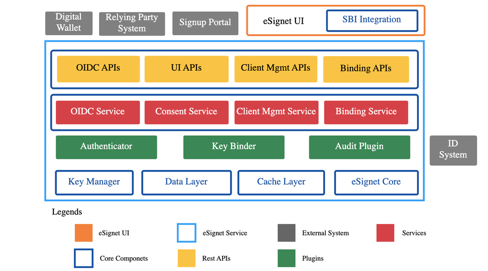

# Components - eSignet

The image below represents a **block diagram of eSignet**, illustrating various **components, layers, and external systems** that work together to provide secure identity verification.

<figure><figcaption>
eSignet Components
</figcaption></figure>

### eSignet Components

#### Relying Party System

The [Relying Party](../../general/glossary.md#relying-party) Systems depend on identity providers, such as eSignet, to authenticate and verify the identities of users before granting them access to protected resources or services.

Clients utilizing OpenID Connect within the OAuth 2.0 framework are commonly referred to as Relying Parties (RPs).

In the case of VC issuance, they are simply OAuth 2.0 clients. To ensure enhanced security, eSignet exclusively supports confidential clients.

#### Digital Wallet

[Digital Wallets](../../general/glossary.md#digital-id-wallet) are software-based platforms used to securely store and share the certified credentials of the wallet holder.\
Stored credentials can be used for login with the eSignet, once the credentials are binded with the RSA key pair and the corresponding public key is shared with eSignet.

To know more about the key binding process please refer to [Key Binder Integration Guide](../../esignet-authentication/develop/integration/key-binder.md).

#### **eSignet UI**

This is the user interface component of eSignet, developed using React JS. Its main functionality is to handle user authentication and obtain user consent. eSignet UI seamlessly integrates with the UI REST endpoints provided by **esignet-service**.

* One notable feature of the eSignet UI is its support for multiple languages.
* eSignet UI also offers QR code-based login with support for multiple digital wallets.
* In addition, eSignet UI is compatible with MOSIP SBI 2.0 for biometric capture.
* Furthermore, the eSignet UI provides flag-based captcha validation for OTP login.
* Lastly, the landing page of the eSignet UI showcases the available [.well-known](../../esignet-authentication/develop/configuration/.well-known/README.md) endpoints.


**Note:** Here are a few frequently asked questions on the eSignet UI.

* [How to enable multiple digital wallet support for authentication?](../../general/faq.md#how-to-integrate-wallets-with-esignet-to-provide-wallet-based-authentication)
* [How to configure the expected quality score, timeouts, and number of bio attributes to be captured?](../../general/faq.md#how-to-configure-the-expected-quality-score-timeouts-and-number-of-biometric-attributes-to-be-captur)
* [How to enable or disable the captcha?](../../general/faq.md#how-to-enable-or-disable-the-captcha-in-esignet-ui)


### **eSignet Service**

This service is the primary backend Spring Java application that incorporates various layers and integrates with other components mentioned on this page.

1. **Core components**: The eSignet core library is used to manage core service interfaces, constants, exceptions, validators, and utility methods.
2. **Service layer**: This layer represents the implementation of the interfaces defined in the eSignet core library. Each protocol implementation is a separate service, such as the complete OIDC protocol implementation being part of the oidc-service and VCI protocol implementations residing in the vci-service.
   * Service modules utilize caching to enhance transaction access and update speeds, as well as to prevent the need for persistent storage of transaction details.
   * Persistent storage is only used for OIDC client registration details.
   * Kafka is employed to support asynchronous operations during wallet-based logins.
3. **Rest APIs**: The eSignet-service module exposes REST endpoints for the functionality implemented in the service layer modules.
4. **Key Manager**
   * Key Manager is used for secure key management and cryptography functionalities required by the eSignet service component.
   * It can be integrated with an HSM (hardware security module) for the secure storage of keys.
   * Typically, Key Manager is run as a service, but it is used as a library in the eSignet Service to minimize the effort of managing extra containers.
   * It depends on the data layer for maintaining the metadata on keys.
5. **Plugins**: Integration points with external systems are designed to be pluggable, allowing easy integration with any ID system. The pluggable integration points are as follows:
   * [**Authenticator Plugin**](../develop/integration/authenticator.md)- for identity verification
   * [**Audit Plugin** ](../develop/integration/audit.md)- for auditing all events
   * [**Key Binder Plugin**](../develop/integration/key-binder.md) - for key binding of a user and wallet

All plugin interfaces are defined in the [esignet-integration-api](https://github.com/mosip/esignet/tree/master/esignet-integration-api) module.

### Sign up Portal

The [SignUp portal](../../esignet-signup/signup-portal.md) provides a user-friendly registration interface that allows users to securely create and manage accounts.

### **Identification System (ID system)**

The ID System is a fundamental identity repository that stores demographic and biometric details (if applicable).

* **Storage Options:** This can be a database or a dedicated system.
* **Verification & Data Sharing:** Facilitates identity verification and enables secure data exchange with eSignet.
