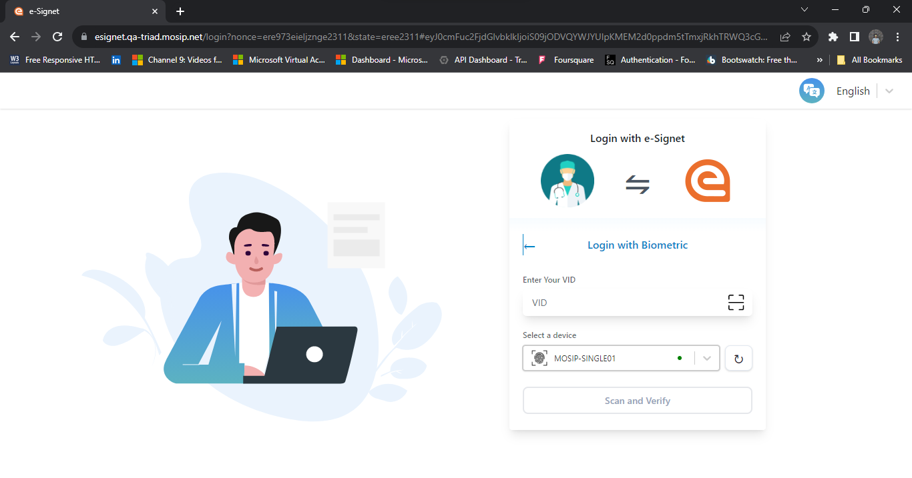
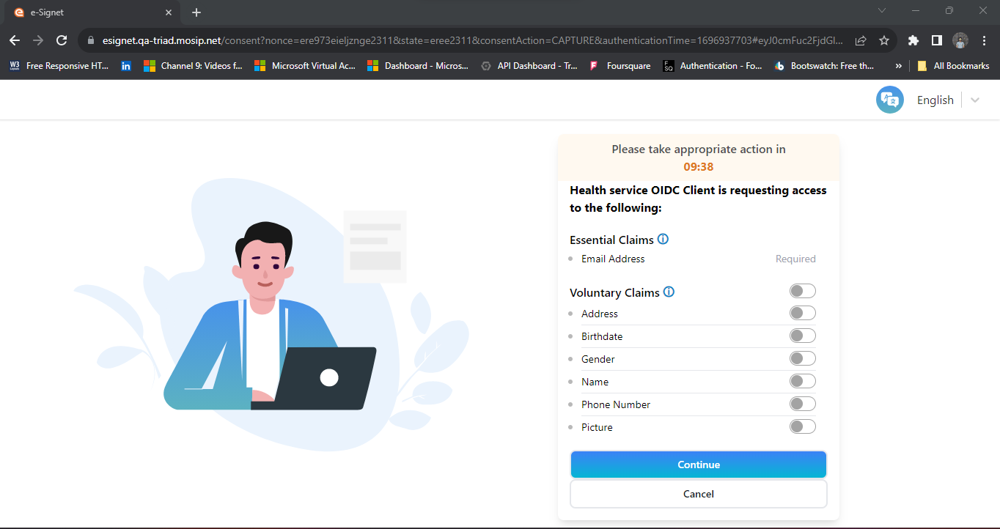
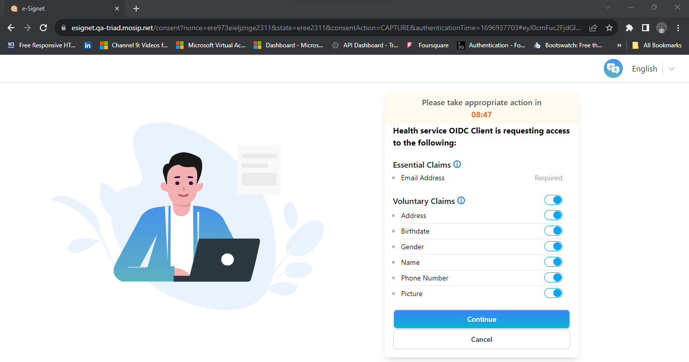

== Login with Biometrics

The login with biometrics is illustrated with the help of a demo health
portal.

{empty}1. On the portal, the resident clicks on *_Sign In with
eSignet_*.

Health Portal login page

{empty}2. To get started with login using biometrics, the resident
clicks *_Login with Biometrics_*.

Login with Biometrics

{empty}3. The resident needs to enter a valid VID in the *_Enter Your
VID_* text field.

Scanning Devices for Biometric

{empty}4. Next, the resident selects a device (face/ iris/ finger) and
provides their biometrics.

A new "`Refresh`" button has been implemented to facilitate the display
of recently connected devices in the list.

The resident clicks on the *_Scan and Verify_* button.

{empty}5. The resident is then navigated to the Consent page. On this
page, the *Essential* and *Voluntary* claims are displayed.

++{++% hint style="`info`" %} The consent screen is presented solely to
the resident if consent has not previously been obtained. Additionally,
a timer is incorporated into the consent screen, allowing the resident
to respond within the designated time frame. If the allotted time
elapses, residents will be redirected to the relying party user
interface. ++{++% endhint %}

{empty}6. The resident is given the option to choose from a list of
authorized scopes and voluntary claims. The essential claims are
mandatory and cannot be modified. In eSignet, a "`*master toggle
button*`" has been added to allow residents to select all the options at
once if desired.

{empty}7. The resident clicks on the *_Allow_* button. The system
navigates the resident to the User Profile page and the page displays
their details based on the consent provided.

.Profile page
image::../../../../end-user-guide/login-with-biometrics/_images/new8-healthServices-user-profile.png[Profile
page]
