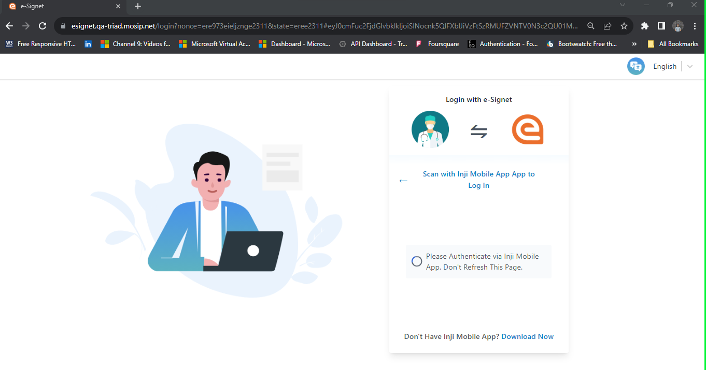
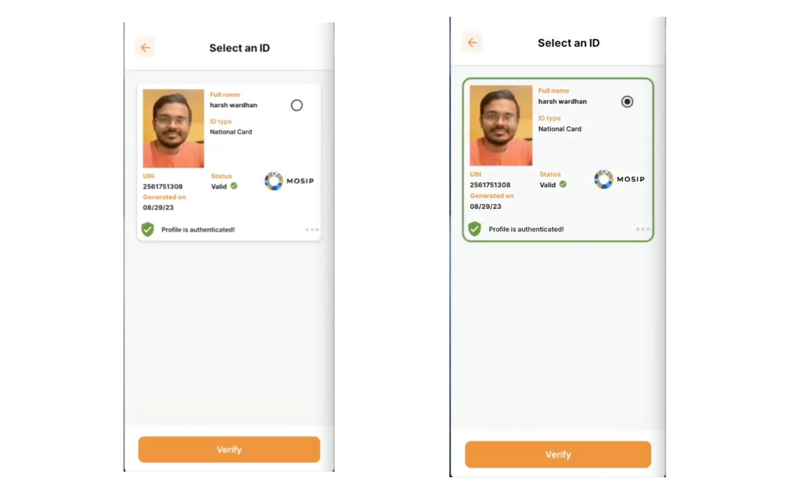
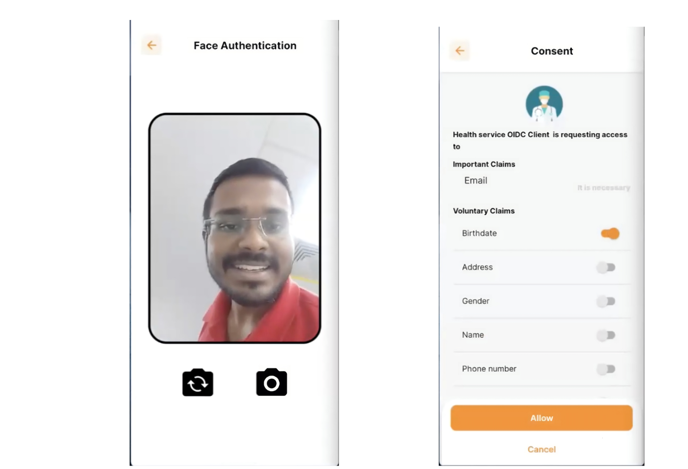
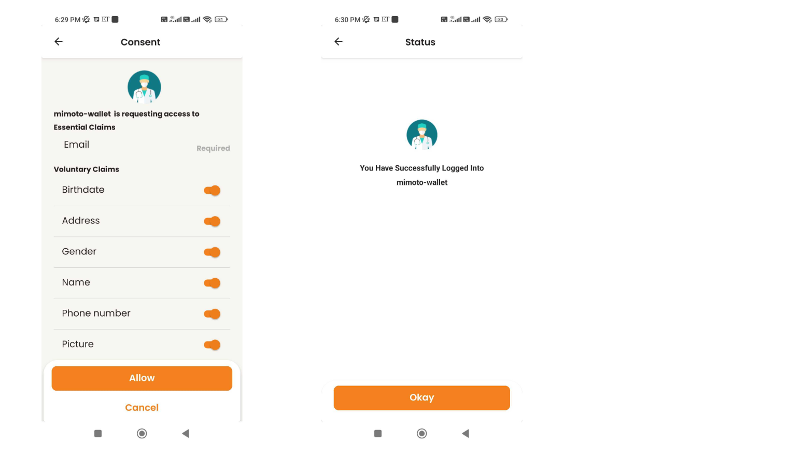

== Login with QR code (Inji)

++{++% hint style="`success`" %} *Prerequisites:*

* Residents should have the Inji app installed on their mobile devices.
* They should have credentials downloaded and should have activated it
for online login. To know how to activate the VC for online login, refer
https://docs.mosip.io/inji/inji-wallet/backend-services/mimoto#wallet-binding[Inji
User Guide]. ++{++% endhint %}

{empty}1. Resident launches the relying party’s portal and clicks on
*_Sign In with eSignet_*.

Health Portal Home Page

{empty}2. Resident selects the *_Login with Inji Mobile App_* option.

Login with Inji

[arabic, start=3]
. Now, the resident can scan the QR code displayed on the portal using
Inji (on their mobile device).

Inji QR code

As seen below, the authentication is in progress.

[arabic, start=4]
. On Inji, the resident can see the VC that is activated for online
login. Select the VC and click *_Verify_*.

[arabic, start=5]
. After clicking on *_Verify_*, the resident is asked to perform face
authentication. On successful authentication, the *Consent* screen is
displayed.

[arabic, start=6]
. Here, the residents can provide their consent and click *_Allow_*. A
successful message is displayed on Inji.

[arabic, start=7]
. The resident can log into the relying party portal and view their
details on the user profile page.

image:../../../../end-user-guide/login-with-qr-code/_images/7.final.png[../../../../end-user-guide/login-with-qr-code/++_++images/7.final]
