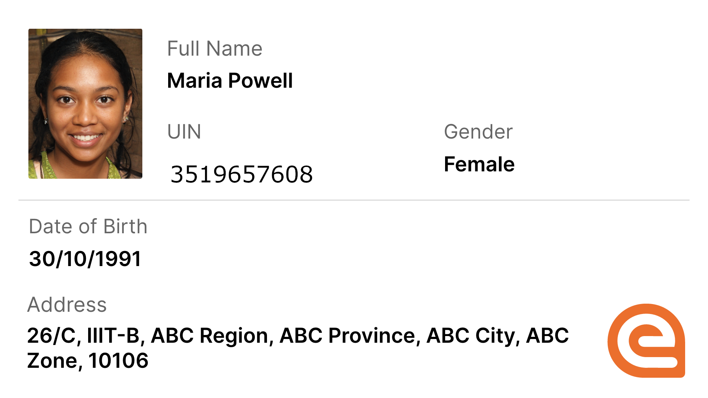
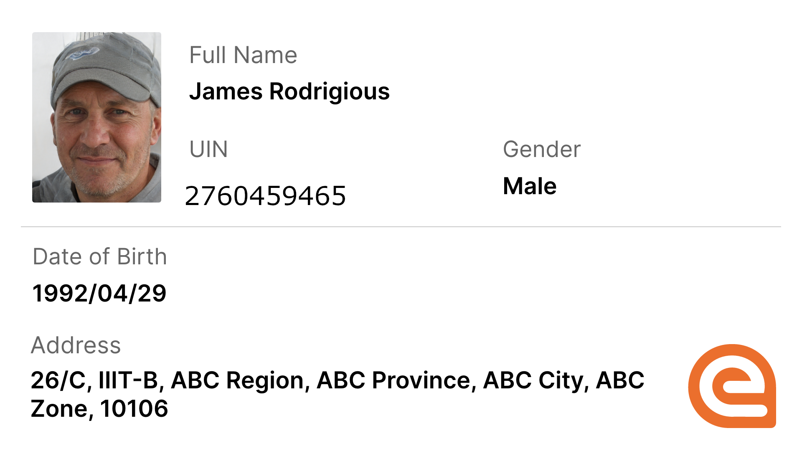
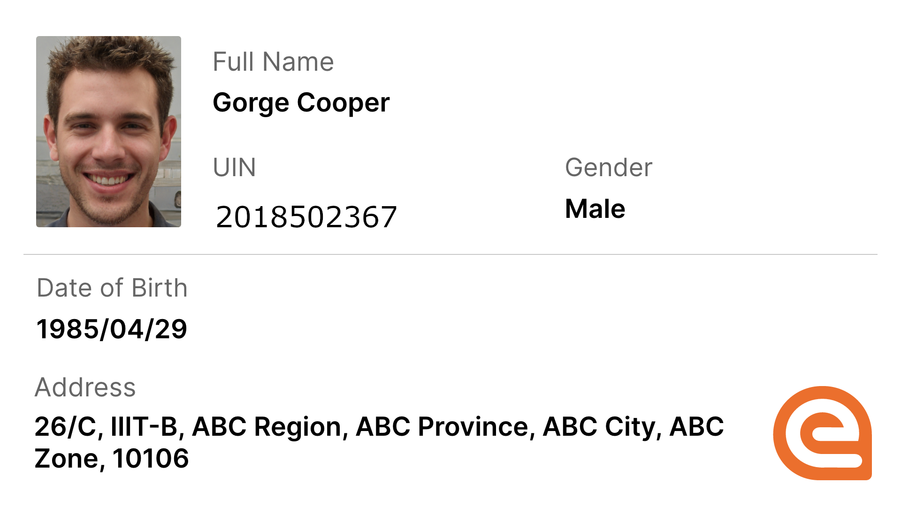
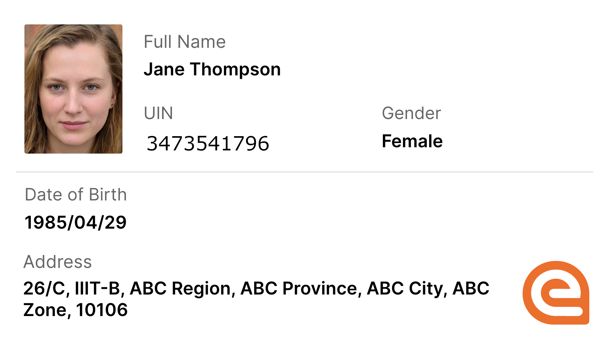

# Using Mock Data

While you want to explore eSignet, you can use the following test personas in our Collab environment.

## Personas

 

 

Individual images are included to facilitate **selfie authentication** for the Inji application.

Please select the appropriate image file corresponding to the chosen UIN above.


**Note:** The data used for these Virtual IDs (VIDs) is entirely fictitious, and the images displayed are AI-generated from an [external website](https://this-person-does-not-exist.com/en).


### Steps to use eSignet

We have developed a **mock health portal** that functions as a **relying party web portal**. As an end user, you can simulate accessing online health services by logging in with your **national ID** via eSignet.

🔗 Access the Collab Health Portal [**here**](https://healthservices-esignet-mock.collab.mosip.net/).

### OTP Authentication

To simplify testing with mock data, eSignet supports OTP authentication.

* You can use any of the provided [personas](using-mock-data.md#personas) above for testing.
* The default OTP for testing is "111111" (six ones).

For a step-by-step guide on logging in with OTP using eSignet, refer to [this detailed guide](../end-user-guide/health-portal/login-with-otp.md).
