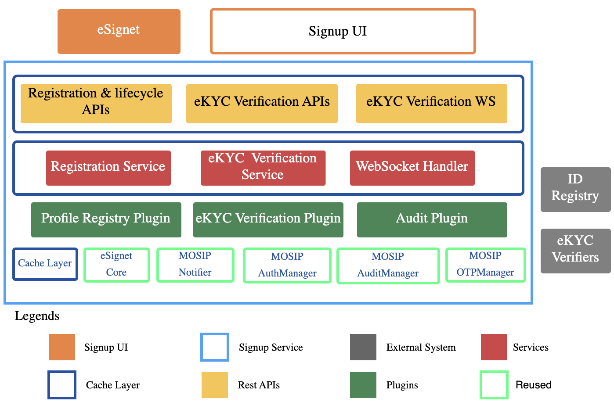

# Components - Signup Portal

The image below is a block diagram of the sign up portal comprising various components along with the different layers and external systems.

<figure><figcaption>
Signup components
</figcaption></figure>

## **Signup UI**

This is the user interface component of the Signup portal is developed using React JS. Its main functionality is to handle user registration and eKYC verification. Signup UI seamlessly integrates with the UI REST endpoints provided by the signup service. The Signup UI supports multiple languages. Signup UI verifies the OTP before the user registration. A notable feature added in the signup UI is to carry out video-based eKYC verification.

## Signup Service

This service is the primary backend spring Java application that incorporates various layers.

1. **Services:** This layer defines the services implemented in the signup service. Registration service implements all the business logic related to OTP verification and the registration process. As we currently support a video-based online eKYC verification process, it requires two-way communication between UI and the backend service. To support this we establish a WS connection between signup UI and signup service, WebSocket Handler manages the WebSocket connection. eKYC verification service contains the logic to initiate and manage the eKYC verification transaction.
2. **Rest APIs:** This layer exposes REST endpoints for the functionality implemented in the service layer.
3. **Cache Layer:** The signup service maintains complete transaction details in the cache. Currently, supports “simple” and “redis” cache types.
4. **Plugins**: Integration points with external systems are designed to be pluggable, allowing easy integration. The pluggable integration points are as follows:
   * [**Profile Registry Plugin**](integration-guide-signup-portal/profile-registry-plugin.md)- To create and update user identity data
   * [**Identity Verifier Plugin**](integration-guide-signup-portal/identity-verifier-plugin.md) - Plugin to verify the user identity data, basically the backend for the eKYC verification process.
   * [**Audit Plugin**](../../esignet-authentication/develop/integration/audit.md) - For auditing all events
5. **Reused**: Modules from the MOSIP platform and eSignet are reused in the Signup service instead of rewriting the existing logic.


**Note**: All plugin interfaces are defined in the [signup-integration-api](https://github.com/mosip/esignet-signup/tree/master/signup-integration-api) module.


## eKYC Verifiers

Trusted claim providers are authorized(depending on policies and regulations) to carry out an identity verification process in which the user is asked to provide proof and prove legitimacy concerning the user's account.

## ID Registry

An ID Registry is a system or database that stores and manages identity information about individuals or entities. An ID Registry is a critical part of digital identity management, acting as a centralized repository for authenticating and verifying the identity of users.\
In the context of the Signup Portal, the ID Registry could refer to any external system or service that stores user identity information. When a user registers, the Signup Service may interact with an ID registry to validate and store details like the user’s email, phone number, or even government-issued ID, ensuring that the identity is legitimate and unique.
