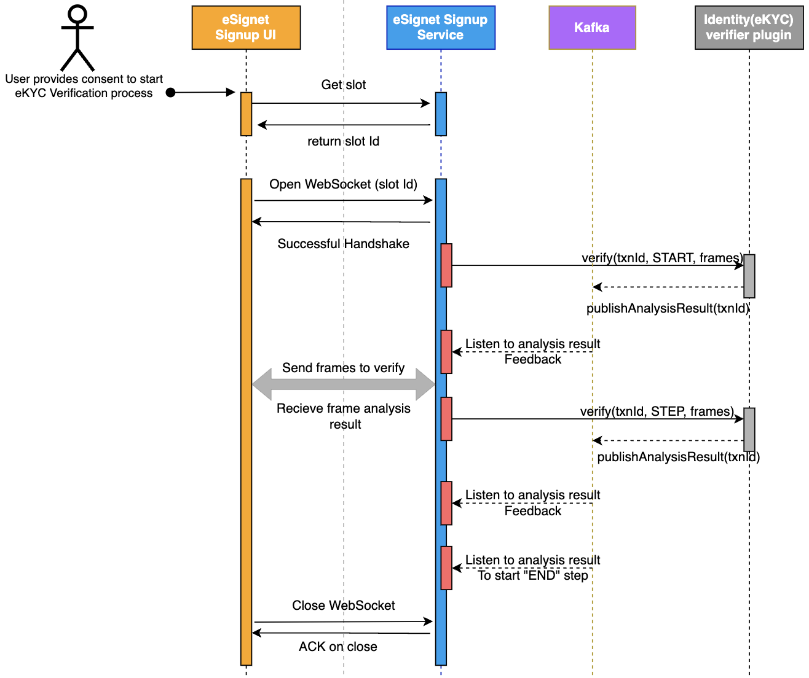

# Identity Verifier Plugin

Identity Verifier plugin helps an external relying party to come as a trusted eKYC partner (verifier). The plugin is used by the verifier to verify an authenticated user (who already signed up with eSignet). An 'authenticated user' can now go to the signup portal, and choose from the list of trusted verifiers, and go through the verification process to update his/her profile with verification metadata and mark claims as verified. With this identity Verifier plugin a video based online verification process has been designed.

The video based process can be used to verify for following:

1. Liveliness check
2. Face match
3. Document verification
4. Disability check

After a successful verification, the verified claims and the verification metadata can be stored in the ID registry which essentially means a successful user verification and thus user creation in the system.

#### How does it work under the hood? <a href="#how-does-it-work-under-the-hood" id="how-does-it-work-under-the-hood"></a>

* Every verification process can consist of any combination of steps.
* Signup service can **start** the process and **end** the process when signaled by the chosen verifier.
* The end-step will expect verification details of the User and will update this in the ID registry (against this authenticated end user's individual ID).

#### How is the 'user authenticated' context shared with the signup portal? <a href="#how-is-the-user-authenticated-context-shared-with-the-signup-portal" id="how-is-the-user-authenticated-context-shared-with-the-signup-portal"></a>

* Authentication of the user before the verification process is carried out in eSignet(OP).
* An authenticated user's transaction is shared as an id\_token\_hint to the signup portal.
* The signup portal now takes the role of an RP and starts OIDC flow in eSignet with "mosip:idp:acr:id-token" ACR. As the authorize request already contains id\_token\_hint, the user will not be prompted to enter credentials, However! It may still prompt to user to provide consent, only if required, Most of the time, a "sub" claim in the user info response should suffice the requirement.

#### Provision to integrate with any Identity verification workflow <a href="#provision-to-integrate-with-any-identity-verification-workflow" id="provision-to-integrate-with-any-identity-verification-workflow"></a>

The signup service has a provision to add any steps between the **start** and **end** step in the verification workflow. We have defined the IdentityVerifierPlugin.java abstract class.

#### What is it that the Verifier will only need to take care of? <a href="#what-is-it-that-the-verifier-will-only-need-to-take-care-of" id="what-is-it-that-the-verifier-will-only-need-to-take-care-of"></a>

1. Initializing every workflow run with the required configuration based on the provided input.
2. Verify the input frame based on the current step and publish the feedback or details about the next step to start in this run to kafka (publishAnalysisResult concrete method is already defined in the plugin abstract class).
3. Once the verifier decides to **end** the workflow run, it should hint the signup service by publishing **end** step details using the same publishAnalysisResult concrete method.
4. The signup service will invoke the getVerificationResult method implemented by the verifier to fetch the verification details. VerificationResult can either be a failure or successful. The same will be conveyed to the end user.

#### How to add Verifier and its workflow details? <a href="#how-to-add-verifier-and-its-workflow-details" id="how-to-add-verifier-and-its-workflow-details"></a>

1. Verifier details should be added signup-identity-verifier-details.json
2. Create a JSON file with workflow details, file should be named after the verifier ID as defined in the signup-identity-verifier-details.json

Refer to signup-idv\_mock-identity-verifier.json the sample workflow details file. Note the file name is prepended with constant "signup-idv\_"

Please refer to the sequence diagram below for the detailed working flow of the identity verifier plugin.

<figure><figcaption><p>Integration Verifier</p></figcaption></figure>

Please refer below for the Identity Verifier Plugin reference implementation:

```java
public abstract class IdentityVerifierPlugin {

    private static final String START_STEP = "START";
    private static final String END_STEP = "END";
    public static final String RESULT_TOPIC = "ANALYZE_FRAMES_RESULT";

    @Autowired
    public KafkaTemplate<String, IdentityVerificationResult> kafkaTemplate;

    protected void publishAnalysisResult(IdentityVerificationResult identityVerificationResult) {
        log.info("publishAnalysisResult by {} invoked with result : {}", identityVerificationResult.getVerifierId(), identityVerificationResult);
        kafkaTemplate.send(RESULT_TOPIC, identityVerificationResult);
    }

    public final boolean isStartStep(String stepCode) {
        return START_STEP.equalsIgnoreCase(stepCode);
    }

    public final boolean isEndStep(String stepCode) {
        return END_STEP.equalsIgnoreCase(stepCode);
    }

    /**
     * Get unique identity verifier ID
     * @return
     */
    public abstract String getVerifierId();

    /**
     * Get the list of supported process types
     * @return
     */
    public abstract List<ProcessType> getSupportedProcessTypes();


    /**
     * Initialize the transaction with individualId and the disability type (if any)
     * @param transactionId
     * @param identityVerificationInitDto
     */
    public abstract void initialize(String transactionId, IdentityVerificationInitDto identityVerificationInitDto);

    /**
     * Verify the input frames based on the provided step code. TransactionId should be used to maintain the state of the
     * verification process.
     * It is expected to send the first step detail when the stepCode is passed as "START".
     * Once all the steps are completed in the process, this method to return stepCode as "END" to mark the completion of
     * identity verification process.
     * @param transactionId
     * @param identityVerificationDto
     * @throws IdentityVerifierException
     */
    public abstract void verify(String transactionId, IdentityVerificationDto identityVerificationDto) throws IdentityVerifierException;

    /**
     * Once the "END" stepCode is reached in the verify method, getVerifiedResult method is invoked to fetch the final
     * result if the identity verification process.
     * @param transactionId
     * @return
     * @throws IdentityVerifierException
     */
    public abstract VerificationResult getVerificationResult(String transactionId) throws IdentityVerifierException;
}
```
