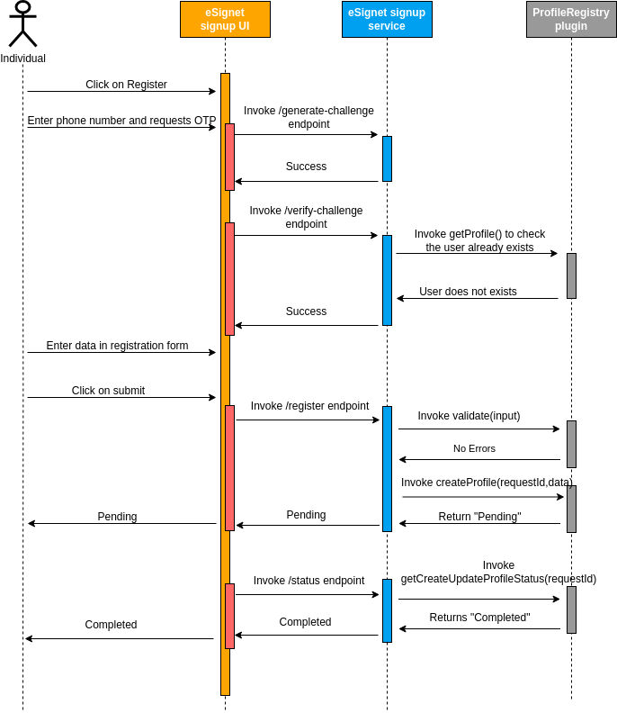

# Profile Registry Plugin

ID registry plugin enables eSignet's Signup service to integrate with any Id registry system. This essentially means that eSignet now does away with tight integration with MOSIP ID-repository and makes way for any ID Repository system to be integrated with eSignet.

The dependency on the MOSIP ID repository has been removed in eSignet Sign Up Service versions 1.1.0 and above.

Please refer to the sequence diagram below for the detailed working flow of the profile registry plugin.

<figure><figcaption><p>Profile Registry Plugin</p></figcaption></figure>

Please refer below for the Profile Registry Plugin interface:

```java
public interface ProfileRegistryPlugin {

    /**
     * Validates the input data in the profileDto.
     * validation on mandatory fields, field values, allowed values should be implemented in this method.
     * Allowed action values for the captured profileDto. Allowed values are "CREATE" and "UPDATE"
     * On any error throw exception with respective errorCode
     * These errorCodes will be displayed in the UI with message from the i18n bundle
     */
    void validate(String action, ProfileDto profileDto) throws InvalidProfileException;

    /**
     * Method to create a user profile.
     * validate method is invoked on the profileDto before passing the same profileDto to createProfile method
     */
    ProfileResult createProfile(String requestId, ProfileDto profileDto) throws ProfileException;

    /**
     * Method to update a user profile.
     * validate method is invoked on the profileDto before passing the same profileDto to updateProfile method
     */
    ProfileResult updateProfile(String requestId, ProfileDto profileDto) throws ProfileException;

    /**
     * Method to get profile status for the input individualId
     * Profile status may differ from one ID registry to the other.
     * esignet-signup service accepted status are ACTIVE, INACTIVE
     */
    ProfileCreateUpdateStatus getProfileCreateUpdateStatus(String requestId) throws ProfileException;

    /**
     * Method to get the profile, usually used to check the existence of the profile based on the
     * input individual ID.
     */
    ProfileDto getProfile(String individualId) throws ProfileException;

    /**
     *
     * @param identity
     * @param inputChallenge
     * @return
     */
    boolean isMatch(JsonNode identity, JsonNode inputChallenge);
}
```
