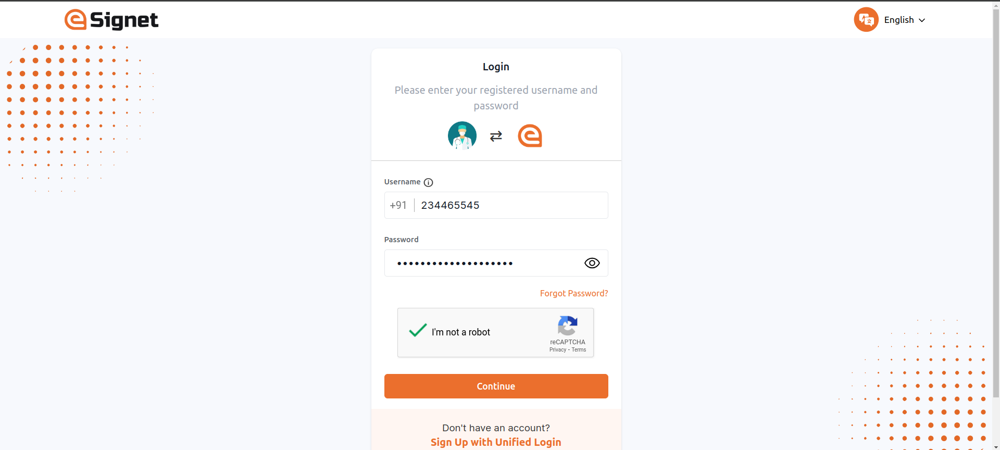
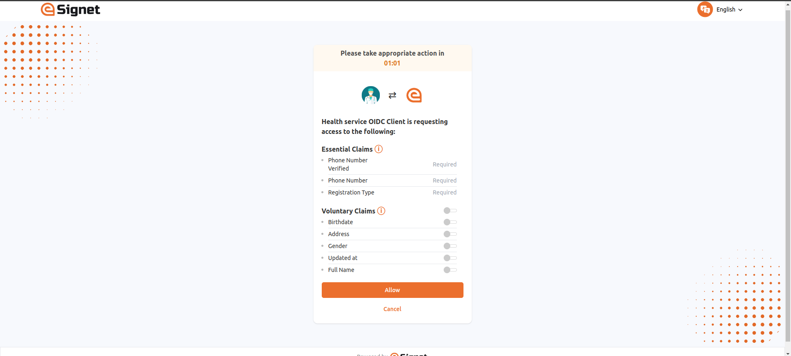
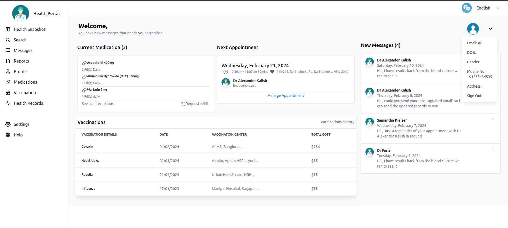

== Login with Password

++{++% hint style="`success`" %} *Prerequisites:*

The resident is registered with a username and password using eSignet’s
Signup portal. In the below demo application, we are using the
resident’s phone number as a username. ++{++% endhint %}

{empty}1. On the portal, the resident clicks on the button *Sign In with
eSignet*.

Sign in with eSignet page

The login screen appears, and the resident is displayed with the options
they can choose for login.

++{++% hint style="`info`" %} *Note:* +
If the `acr++_++values` the query parameter is presented with only one
`acr` in the authorized URL, then the login options page is skipped, and
the resident is directly taken to the login page. ++{++% endhint %}

{empty}2. The resident needs to enter a registered username in the
*Enter 8–9-digit mobile number* and password in the *Enter password*
text field and check the box '`I’m not a robot`'.

The password-based authentication is secured with a captcha.

{empty}4. Next, the resident clicks the *Continue* button.

++{++% hint style="`info`" %} Note:

* The login with Password form also has a link to *Sign Up With Unified
Login* to navigate to the Signup portal, if the resident is still not
registered.
* *Forgot password* link is also available for resident to navigate to
the signup portal to reset the password.
* Resident can resume back login after successful registration as well
as after successful reset of password. ++{++% endhint %}

{empty}5. The resident is then navigated to the Consent page. On this
page, the *Essential* and *Voluntary* claims are displayed.

++{++% hint style="`info`" %} The consent screen is presented solely to
the resident if consent has not previously been obtained. Additionally,
a timer is incorporated into the Consent screen, allowing the resident
to respond within the designated time frame. If the allotted time
elapses, residents will be redirected to the relying party user
interface. ++{++% endhint %}

{empty}6. The resident should now click the *Allow* button. The system
navigates the resident to the *User Profile* page which displays all the
personal information based on the consent provided.

