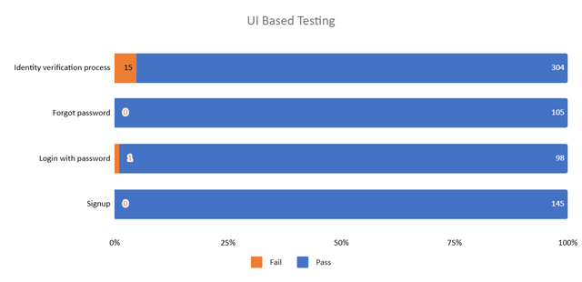

# Test Report

## Testing Scope

The scope of testing is to verify fitment to the specification from the perspective of&#x20;

●     Functionality&#x20;

●     Deployability&#x20;

●     Configurability&#x20;

●     Customizability

Verification is performed from the end user perspective and the System Integrator (SI) point of view. Hence, the software's Configuration and Extensibility are also assessed. This ensures the software's readiness for use in multiple countries. Since MOSIP is an “API First” product platform, the Verification scope required comprehensive automation testing for all the MOSIP APIs. An automation Test Rig was created for the same.&#x20;

### **Test Approach**

A persona-based approach has been adopted to perform the IV\&V by simulating test scenarios that resemble a real-time implementation.&#x20;

A Persona is a fictional character/user profile created to represent a user type that might use a product/or a service in a similar way. Persona based testing is a software testing technique that puts software testers in the customer's shoes, assesses their needs from the software, and thereby determines use cases/scenarios that the customers will execute. The persona’s needs may be addressed through any of the following.&#x20;

* Functionality &#x20;
* Deployability &#x20;
* Configurability &#x20;
* Customizability

The verification methods may differ based on how the need was addressed.&#x20;

For regression check, “MOSIP Test Rig” - an automation testing suite - is designed and developed to support persona-based testing. MOSIP Test Rig covers the end to end test execution and reporting. The end to end functional test scenarios are written starting from pre-registration, to creating the packet in the registration center, processing the packet through the registration process, generating UIN, and authenticating identity using IDA through various permutations and combinations of cases being covered. MOSIP Test Rig will be an open source artifact that can also be enhanced and used by countries to validate the SI deliveries before going live. Persona classes include both negative and positive personas. Negative persona classes include users like Bribed Registration Office, Malicious Insider, etc. The needs of positive persona classes must be met, whereas the software must effectively restrict the needs of negative persona classes.

### **Verified configuration**&#x20;

Verification is performed on various configurations as mentioned below&#x20;

* Default configuration - with 7 Languages (English/Khmer/Hindi/Kannada/Tamil/Arabic/French)

### **Main feature tested**

* Signup Portal with mock ID
* Login with a Password with a mock ID
* Forgot Password with mock ID
* Login with Otp with a mock ID
* Login with biometrics with mock ID
* Login with KBI with a mock ID
* Identity verification process with mock ID
* Signup Portal with Mosip IDA
* Login with Password with Mosip IDA
* Forgot Password with Mosip IDA
* Login with Otp with Mosip IDA
* Login with biometrics Mosip IDA
* Login with KBI with Mosip IDA

### Feature Health

<figure><figcaption>
Feature Health
</figcaption></figure>

### **Functional test results**

Below are the test metrics by performing functional testing using mock MDS, mock Auth, and mock ABIS. The process followed was black box testing which based its test cases on the specifications of the software component under test. The functional test was performed in combination with individual module testing as well as integration testing. Test data were prepared in line with the user stories. Expected results were monitored by examining the user interface. The coverage includes GUI testing, System testing, End-To-End flows across multiple languages and configurations. The testing cycle included the simulation of multiple identity schema and respective UI schema configurations.

| Total | Passed | Failed | Skipped |
| ----- | ------ | ------ | ------- |
| 2928  | 2785   | 97     | 46      |

**Test Rate:** 98% with **Pass rate:** 96%

Here is the detailed breakdown:

**API Based Testing - eSignet:**

| Total Test Cases | Passed | Failed | Skipped |
| ---------------- | ------ | ------ | ------- |
| 1934             | 1829   | 79     | 26      |

**UI Based Testing:**

| Total Test Cases | Passed | Failed | Skipped |
| ---------------- | ------ | ------ | ------- |
| 994              | 956    | 18     | 20      |

#### **API Testrig results for eSignet and Signup with Mock ID**

**API Based Testrig - eSignet:**

| Total Test Cases | Passed | Failed | Skipped | Ignored |
| ---------------- | ------ | ------ | ------- | ------- |
| 813              | 445    | 0      | 0       | 368     |

**API Based Testrig - eSignet-signup:**

| Total Test Cases | Passed | Failed | Skipped | Ignored |
| ---------------- | ------ | ------ | ------- | ------- |
| 554              | 516    | 34     | 4       | 0       |


**Note:**&#x20;

* In API Based testing - 26 test cases are marked as skipped as they were not automated and cannot be tested using Postman.
* In UI Based testing - 20 test cases are marked as skipped as they were out of scope for the release.
* In API Based Testrig - eSignet, 368 testcases are marked as ignored as VID is not supported.


#### **Detailed Test metrics:**

Below are the detailed test metrics by performing manual/automation testing. The project metrics are derived from Defect density, Test coverage, Test execution coverage, test tracking, and efficiency.&#x20;

The various metrics that assist in test tracking and efficiency are as follows:

* **Passed Test Cases Coverage:** It measures the percentage of passed test cases. (Number of passed tests / Total number of tests executed) x 100
* **Failed Test Case Coverage:** It measures the percentage of all the failed test cases. (Number of failed tests / Total number of test cases executed) x 100

#### **Device and Browser details:**

<table><thead><tr><th>Device</th><th>Browser</th><th>OS version</th><th width="167">Display resolution</th><th>Screen size</th></tr></thead><tbody><tr><td>Oppo A96 v11.0</td><td>Chrome</td><td>Android, v11.0</td><td>1080x2412 px</td><td>6.59</td></tr><tr><td>Samsung Galaxy S8 v7.0</td><td>Fire fox</td><td>Android, v7.0</td><td>1440 x 2960 px</td><td>5.8</td></tr><tr><td>Redmi 6A</td><td>edge, chrome &#x26; firefox</td><td>Android, v9.0</td><td>1440 x 720 px</td><td>5.45</td></tr><tr><td>iPhone XS v15.3</td><td>safari</td><td>iOS, v15.3</td><td>1125 x 2436 px</td><td>5.8</td></tr><tr><td>iphone 7</td><td>safari, chrome, firefox &#x26; edge</td><td>15.6</td><td>750x 1334 px</td><td>4.7</td></tr><tr><td>Oppo Reno12 Pro</td><td>chrome</td><td>Android 14</td><td>1080 x 2412 pixels</td><td>6.7</td></tr><tr><td>Redmi A1</td><td>chrome</td><td>Android 12</td><td>720 x 1600 pixels</td><td>6.52</td></tr><tr><td>Iphone 15 Plus</td><td>Safari</td><td>IOS 18</td><td>2796x1290 pixels</td><td>6.7</td></tr><tr><td>MOSIP's MacBook Air</td><td>Safari</td><td>Sonoma 14.6.1</td><td>2560*1664</td><td>13.6</td></tr><tr><td>Nokia T10</td><td>chrome</td><td>Android 14</td><td>800 x 1280 pixels</td><td>8</td></tr></tbody></table>

### **Desktop browser specification**

Browser Compatibility for desktop and mobile:

| OS            | Version                  |
| ------------- | ------------------------ |
| Google Chrome | 118. 0.5993.72 and above |
| Firefox       | 118.0.2 and above        |
| Edge          | 118.0.2088.46 and above  |
| Safari        | 14.1 and above           |

### **Sonar Report**

<table data-full-width="true"><thead><tr><th width="180">Repository Name</th><th width="143">Branch Name</th><th width="155">Release Version (POM)</th><th width="108">Coverage (>80%)</th><th width="112">Reliability (0)</th><th>Security (0)</th><th width="109">Hotspots (0)</th><th>Duplications  (Less than 3%)</th></tr></thead><tbody><tr><td>eSignet</td><td>release-1.5.x</td><td>v1.5.0</td><td>86.8%</td><td>0</td><td>0</td><td>0</td><td>0%</td></tr><tr><td>eSignet Signup</td><td>release-1.1.x</td><td>v1.1.0</td><td>81.2%</td><td>0</td><td>0</td><td>0</td><td>0%</td></tr></tbody></table>
